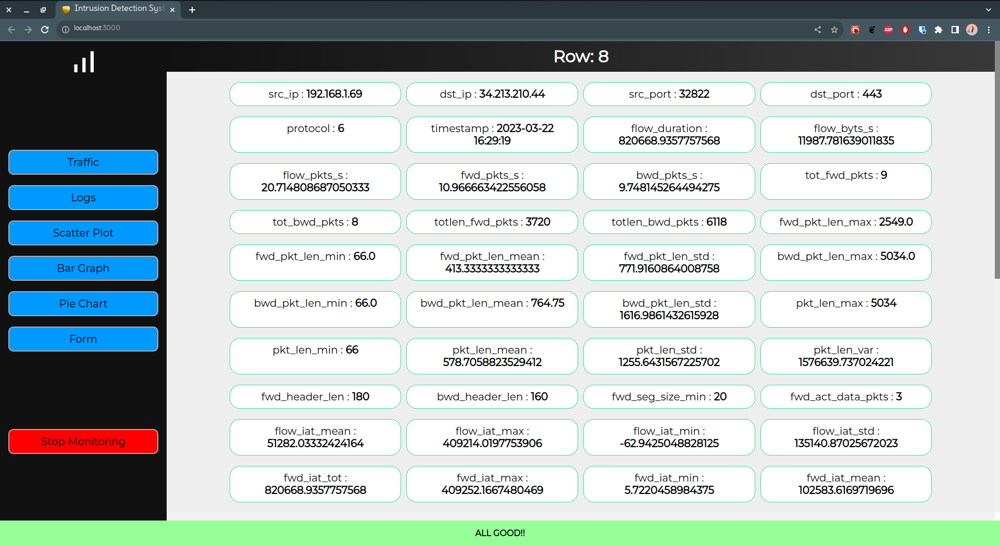
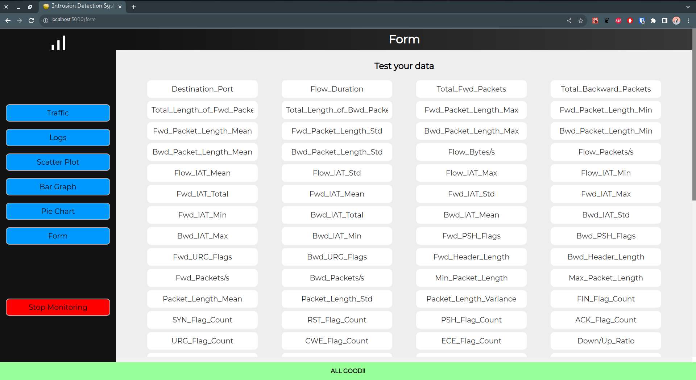
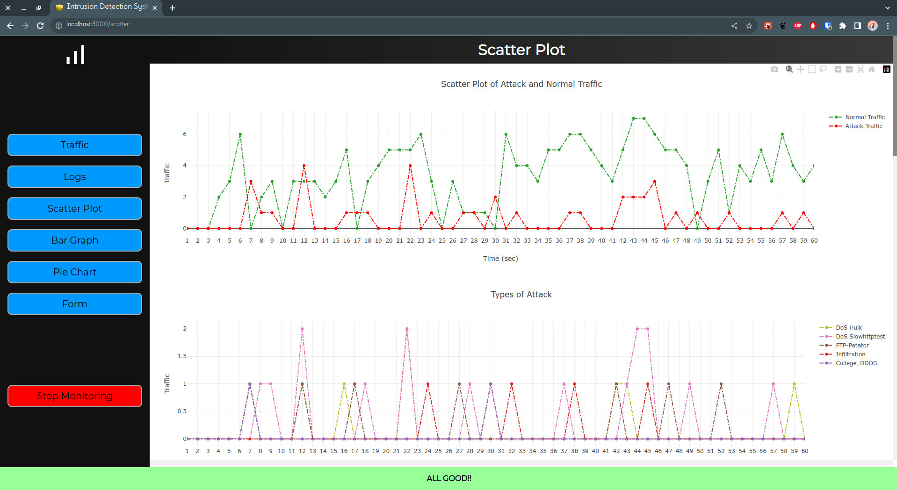

# IDS_GUI

### This is the backend of the IDS. This repo contains references two other repos which are included as submodules and are needed for proper operation of the project.

## Hardware Requirements

### 1. Intel Core i5 or equivalent processor

### 2. Nvidia GPU

## Software Requirements

### 1. Linux OS

The backed server is dependent on some core Linux programs that are not available on Windows. So, Linux OS is required to run the server.

### 2. Node.js

Node.js is needed to spin up the server and npm is needed to install the dependencies of the project.

### 3. Python

The AI model for the IDS has been developed using Python and several python modules are needed for running the model to predict the data.

## Submodule Repositories

### 1. [webgui](https://github.com/abhinandanshrestha/webgui)

This repository contains the frontend of the project developed using React.js.

### 2. [Intrusion-Detection-System-Using-Fewshot-Learning](https://github.com/ManandharSudip4/Intrusion-Detection-System-Using-Fewshot-Learning)

This repository contains the AI model of the project written in python.

## Getting Started

### 1. Clone the repo with `--recursive` flag so that the submodules are cloned with proper names.

`git clone --recursive https://github.com/manandhar01/ids_gui.git`

## Running the app

**NOTE :: The following steps assumes that you have Node.js and npm already installed in the system.**

### 1. Navigate to the cloned project directory.

`cd ids_gui`

### 2. Install necessary node modules for the backend.

`npm install`

### 3. Start the backend server with superuser privileges. The server listens to port **3001**. Port can be changed in **index.js** file at the root directory of the project.

**NOTE :: Make sure that all the python packages mentioned in the `AI/requirements.txt` has been installed in a virtual environment and the virtual environment is activated before starting the backend server.**

`sudo node index.js`

### 4. Navigate to **frontend** directory in a new terminal window.

`cd ids_gui/frontend`

### 5. Install necessary node modules for the frontend.

`npm install`

### 6. Start the frontend server. The server listens to port **3000**.

`npm start`

## Screenshots

